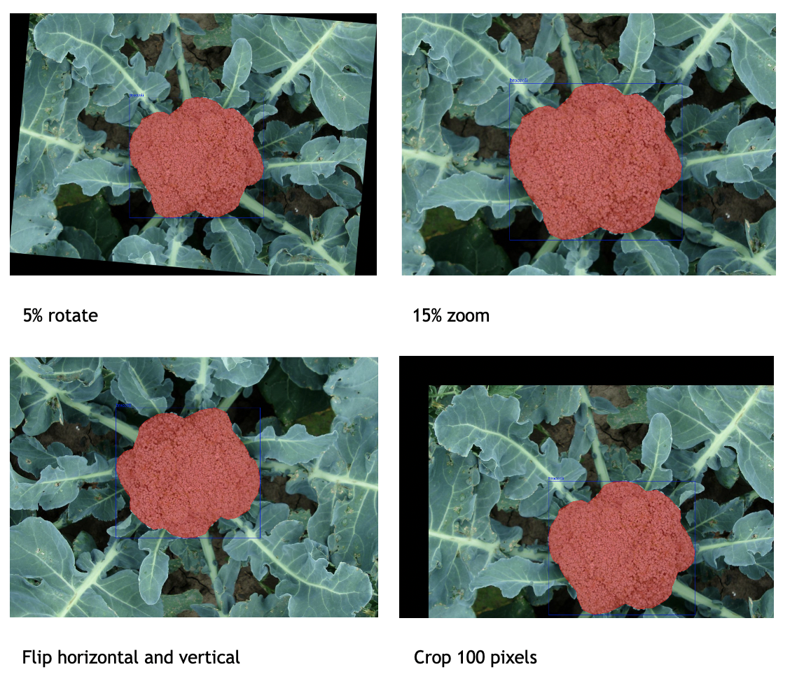
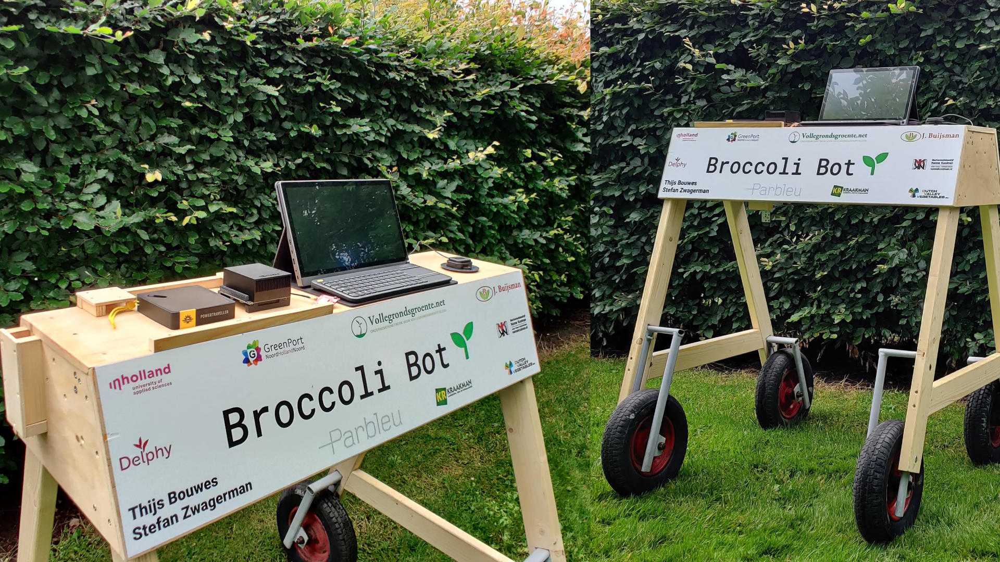

# Broccoli Bot Client - [broccolibot.nl](http://broccolibot.nl/)
This repository contains the code for the proof of concept (broccoli bot).

## Smart Farming Broccoli - Intro
The biggest challenge for broccoli growers is finding (temporary) staff for harvesting broccoli. Harvesting broccoli is a labor intensive and takes around [100 hours](https://www.wur.nl/nl/show/kwin-agv.htm) per hectare. No machines available that harvest selectively with high enough quality and speed. Production in hectares: worldwide [126.000](https://edepot.wur.nl/417517), netherlands [2.500](https://opendata.cbs.nl/statline/#/CBS/nl/dataset/37738/table?fromstatweb).
In this project, the technical feasibility of a machine is investigated, which makes it possible to harvest broccoli with the right size.​

In February 2021, two students from Inholland University of Applied Sciences started their graduate internships for the Smart Farming Broccoli project. ​

Thijs Bouwes, a 4th year Technical Computer Science student, is working on the development of an image recognition method for broccoli.​

Stefan Zwagerman, a 4th year Mechanical Engineering student, is developing a gripper that can be used to harvest broccoli.​

## Broccoli Bot
To harvest a broccoli the exact location and size are required. We looked into related agriculture projects:
- [Deep learning in agriculture: A survey](https://www.sciencedirect.com/science/article/abs/pii/S0168169917308803)
- [A field‐tested robotic harvesting system for iceberg lettuce](https://onlinelibrary.wiley.com/doi/full/10.1002/rob.21888)
- [3D-vision based detection, localization, and sizing of broccoli heads](https://www.researchgate.net/publication/318141608_3D-vision_based_detection_localization_and_sizing_of_broccoli_heads_in_the_field_KUSUMAM_et_al)
- [Ontwikkeling en validatie van computer vision technologie ten behoeve van een broccoli oogstrobot](https://research.wur.nl/en/publications/ontwikkeling-en-validatie-van-computer-vision-technologie-ten-beh)
- [A high‐resolution, multimodal data set for agriculturalrobotics: A Ladybird’s‐eye view of Brassica](https://onlinelibrary.wiley.com/doi/abs/10.1002/rob.21877)

After studying these recent projects it was clear deep learning works best for recognizing broccoli in dynamic situations. Broccoli grows outside in diverse situations to always recognize the broccoli a deep learning algorithm needs to be trained on a diverse data set.      

### Data set
The [data set](https://lcas.lincoln.ac.uk/nextcloud/shared/agritech-datasets/broccoli/broccoli_datasets.html) of thu university of Lincoln is used as base, this data set contains two cultivars: Iron Man and Titanium. From the 100 minutes of video 334 images where selected on these images the broccoli was visible and in a unique situation.
The images have been annotated with the tool [LabelMe](https://github.com/wkentaro/labelme) (Polygonal Annotation), the data set can be downloaded through [Google Drive](https://drive.google.com/file/d/1UT0oOEhtnEtcDArdgwuYOUvl5VN2ROKC/view?usp=sharing). To avoid overfitting and do a honest comparison the datset is split as followed:

| Name        | Percentage           | Images  |
| :------------- |:-------------| :-----|
| Training      | 70% | 234 |
| Validation      | 20%      |   67 |
| Test | 10%     |    33 |

During the research we wanted to compare instance segmentation against object detection. We speculated that instance segmentation would recognize the broccoli better (higher mAP).
We selected two algorithms based on a [survey on instance segmentation](https://link.springer.com/article/10.1007/s13735-020-00195-x): [YOLO V4](https://arxiv.org/abs/2004.10934) and [YOLACT](https://arxiv.org/abs/1904.02689).
To compare the to algorithms we trained both algorithms on the custom data set and choose a winner based on:
- Speed FPS
- Average precision [mAP](http://cocodataset.org/#detection-eval)

### Data augmentation
Data augmentation is a technique to increase the test data set. In previous research by the [WUR](https://research.wur.nl/en/publications/ontwikkeling-en-validatie-van-computer-vision-technologie-ten-beh) geometric transformations seem to increase the mAP.
The following transformations have been applied: 5% rotate, 15% zoom, flip horizontal and vertical, crop 100 pixels. The will expend the test data set from 234 to 936 images.


### Hardware
- Intel Core i7-8700K
- 16 GB DDR4 ram
- NVIDIA GTX1070

### Results
| Name        | FPS           | AP  |
| :------------- |:-------------| :-----|
| YOLO V4      | 31.5 | 70.48% |
| YOLO V4 Tiny     | 63.6 | 67.36% |
| YOLACT      | 19.5      |   73.82% |


## Depth camera
To qualify a broccoli as harvestable it needs to meet different requirements. One of the most important requirements is the diameter. After localising the broccoli with a deep learning algorithm the size needs to be determined.
Broccoli grows as a natural product what makes the height of the plant variable (40 to 60cm high). With a depth camera the height of the plant can be measured and the exact diameter can be calculated.

After reading [State-of-the-Art Devices Comparison](https://www.researchgate.net/publication/325866790_State-of-the-Art_Devices_Comparison) the Intel Realsense D415 was chosen.

## Proof of concept
To test the software and hardware we have build a proof of concept. The hardware is different then the training/testing setup, this is because in the field we don't have a power connection.
For this challenge we have chosen the NVIDIA Jetson: powerfull, low power consumption, small form factor. 


### Hardware:
- NVIDIA Jetson AGX Xavier
- Depth camera Intel D415
- Deep learning algorithm YOLO V4
- 15.6” Full HD touchscreen 
- Power Traveller Phoenix 90 Powerstation Li-ion 22.400 mAh, can power the AGX for 2a2.5 hours
- Samsung 970 Evo Plus 1TB, for data collection
- SparkFun GPS-RTK-SMA Breakout - ZED-F9P, for location of broccoli

### Installation
#### AGX - [user guide](https://developer.download.nvidia.com/embedded/L4T/r32-3-1_Release_v1.0/jetson_agx_xavier_developer_kit_user_guide.pdf)
1. Download jetpack sdkmanager (do this on Ubuntu LTS 18.04)
1. `sudo dpkg -i sdkmanager.db`
1. `sudo apt update`
1. `sudo apt --fix-broken install`

Start sdkmanager and flash the AGX, make sure to also install deepstream.

#### Install [YOLO V4](https://github.com/AlexeyAB/darknet)
1. `cd ~/Documents`
1. `git clone https://github.com/AlexeyAB/darknet.git`
1. `cd darknet`
1. Update make file settings:
```
GPU=1
CUDNN=1
CUDNN_HALF=1
OPENCV=1
AVX=0
OPENMP=1
LIBSO=1
ZED_CAMERA=0
ZED_CAMERA_v2_8=0
USE_CPP=0
DEBUG=0
ARCH= -gencode arch=compute_72,code=[sm_72,compute_72]
```
After updating the make file run `make`.

#### Python setup
1. `sudo apt-get install libpython3.6-dev`
1. `cd ~/Documents`
1. `git clone git@github.com:thijsbouwes/broccoli-bot-client.git bbot`
1. `cd bbot`
1. Download weights YOLO V4 [Google drive](https://drive.google.com/file/d/16uuFWwXVRzTpcRRsjfSnkho3oerCey-J/view?usp=sharing)
1. Download weights YOLO V4 Tiny [Google drive](https://drive.google.com/file/d/1dE3DwF1SJIGR5Rd8f6q0mtQFeaJvlUXv/view?usp=sharing)
1. Will default use YOLO V4, change `detection_algorithm.py`
1. Move weights to right dir `mkdir weights && mv yolo-obj_best.weights weights/yolo-obj_best.weights`
1. `sudo apt install python3-pip`
1. `sudo apt install clang`
1. `pip install --upgrade setuptools`
1. `sudo apt install python3-opencv`
1. `pip install -r requirements.txt`

#### QT5 and PySide2
1. OpenSLL `sudo apt install libssl-dev`
1. Cmake min 3.6, read [this](https://askubuntu.com/a/1126495/920517) on how to build from the source
1. Continue the installation with [instructions](https://forums.developer.nvidia.com/t/pyside2-qt-for-python-installation-on-jetson-xavier/160796/5)

### Start
1. `python3 -m bbot`

## Design
### UI


### Class Diagram


### Sequence Diagram


## Data collection
For every broccoli the software will make an image and collect data (diameter and distance). The image is written to `~/bbot/data-collection/images/{year}/{month}/{day}`, the csv file with all the information is written to `~/bbot/data-collection/reports`.

On our Jetson we have created a symbolic link to the SSD (mounted as `/mnt/data`) `ln -s /mnt/data/bbot-data-collection ~/bbot/data-collection`.
